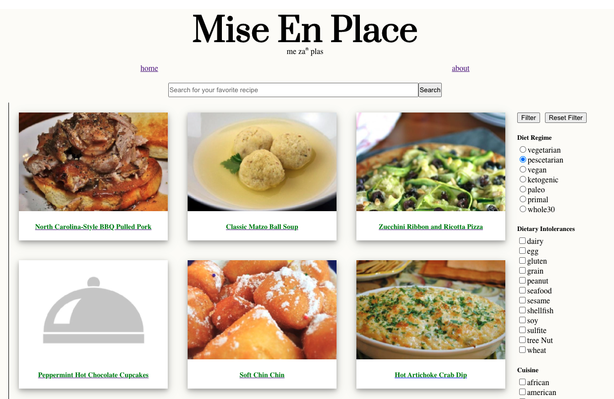
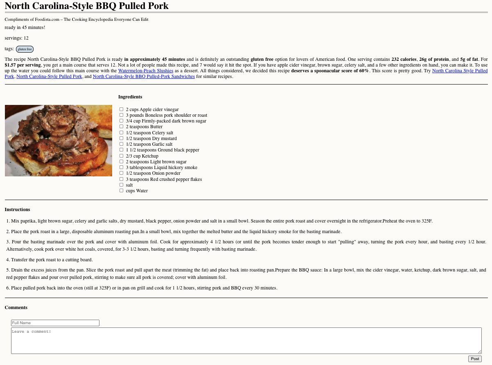
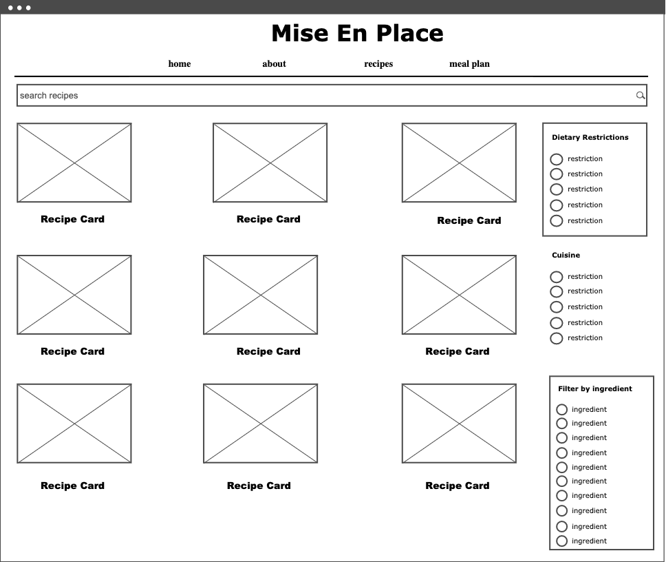
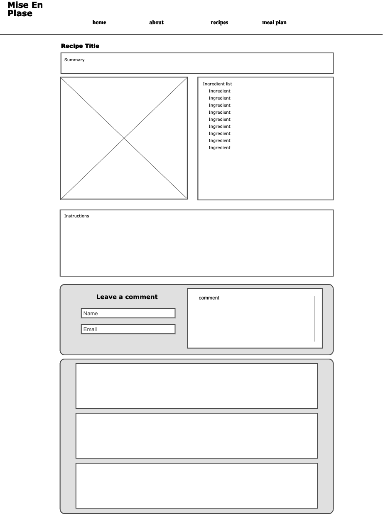

# Recipe Search App

## About

This is a Recipe App that uses SPOONACULAR's API which allows me to search through a number of recipes using advanced filtering.

## The App

## Technologies used
JavaScript/HTML/CSS
React.js library
Heroku
Spoonacular API
Google Fonts

## Wireframes

## User Stories
- As a user, I want to log on and see new recipes so that I may feel inspired.
- As a user, I want to be able to filter by dietary restrictions to avoid falling ill or having a reaction.
- As a user, I want to preview pictures to see what I am having for a meal
- As a user, I want to be able to search for a specific recipe so that I don't have to go down the rabbit hole of filtering.
- As a user, I want to see a short description of the meal.
- As a user, I want to see all the ingredients needed for the meal.
- As a user, I want step-by-step instructions
- As a user, I want to see similar recipes to the one I chose.

## MVP Goals
- [x] main page with random recipe cards
- [x] sidebar with diet regime
- [x] sidebar with dietary restriction filter
- [x] search bar for desired recipes

## Major Hurdles
This project was challenging and I learned a lot from my struggles. My first hurdle was learning how to use Postman to my benifit and how the Spoonacular API functions. My biggest hurdle was trying to pass information from one component to another component and then once its passed, being able to iterate through the elements to be able to display the information I wanted to the page. Another hurdle I continue to have is CSS and styling. 

## Stretch Goals
- [x] filter by cuisine
- [ ] see a given recipes sweetness/savoriness/bitterness/... levels
- [ ] display similar recipes
- [ ] list equipment needed
- [ ] food trivia/jokes